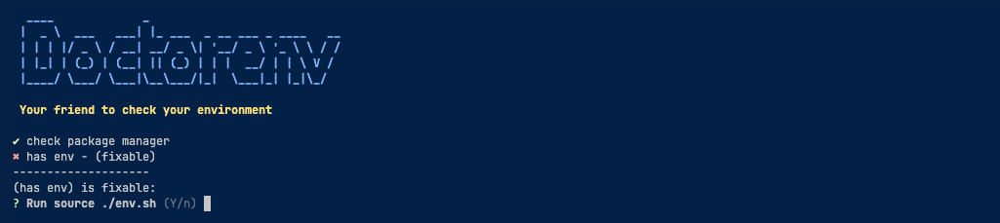

<div align="center">
    
</div>

# Doctorenv


[](https://codecov.io/gh/raphaelkieling/doctorenv)

[Wiki documentation here](https://github.com/raphaelkieling/doctorenv/wiki)

✅ `Doctorenv` is a checklist tool that helps developers to check if they have everything to contribute in a project.

In the end the goal is `Save time`, nothing more! 🚀

### How to install?

```sh
# Without install
npx doctorenv-cli

# Installing globally using npn
npm i -g doctorenv-cli

# Installing globally using yarn
yarn global add doctorenv-cli
```

> I do not recommend to install locally yet, since you do not have any big reason to do it right now. In the future the idea is to have plugin system, hooks and type checking using `require`, up to you.

### Why?

Sometimes you aren't sure if you have everything to contribute in a project. The `Doctorenv` should give you some help on:

- Check what is missing in your environment to make it works
- Giving you some `Suggestions` on how to fix in case you do not met some requirements
- Easy to start using and change
- Automatic fixers

Example of config:

```js
// doctorenv.config.js
module.exports = ({ builder }) => {
  return builder
    .task('check package manager')
    .subTask('has npm', ({ bash }) => bash`npm --version`)
    .subTask('has yarn', ({ bash }) => bash`yarn --version`)
    .task('has env', ({ checkEnv }) => checkEnv('NODE_ENV'))
    .setFixableSuggestion(
      'Run source ./env.sh',
      ({ bash }) => bash`source ./env.sh`
    )
    .build()
}
```

Run:

```sh
# To check the default doctorenv.config.js
doctorenv check

# To check with a custom config
doctorenv check <custom-path-to-config>
```



### Changelog

You can check the changelog [here](CHANGELOG.md).

### How to contribute?

It's simple, just take a look at our [Contributing](CONTRIBUTING.md) guide.

### Contributors

<!-- ALL-CONTRIBUTORS-LIST:START - Do not remove or modify this section -->
<!-- prettier-ignore-start -->
<!-- markdownlint-disable -->
<table>
  <tbody>
    <tr>
      <td align="center" valign="top" width="14.28%"><a href="https://github.com/raphaelkieling"><br /><sub><b>Raphael Kieling</b></sub></a><br /><a href="#code-raphaelkieling" title="Code">💻</a></td>
    </tr>
  </tbody>
</table>

<!-- markdownlint-restore -->
<!-- prettier-ignore-end -->

<!-- ALL-CONTRIBUTORS-LIST:END -->

### Development

```sh
# testing
npm run test
npm run test:watch

# run a specific example in dev mode
npm run dev check examples/NAME_HERE.config.js
```

### Publishing

```sh
npm run publish
```

<small>
Temporary Icon from: <a href="https://www.flaticon.com/free-icons/pharmacist" title="Pharmacist icons">Pharmacist icons created by Freepik - Flaticon</a>
</small>
